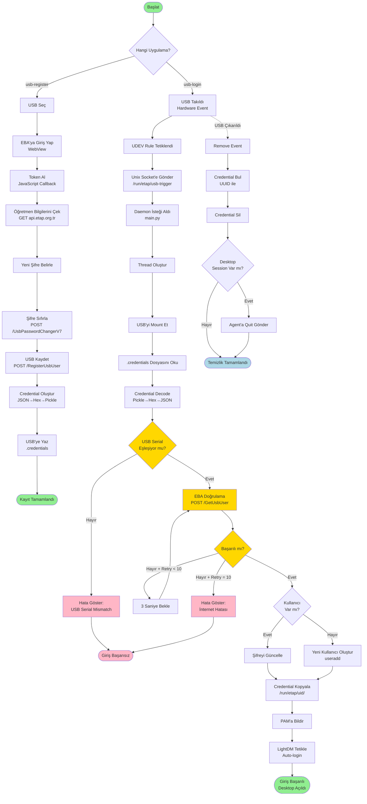

# ETA USB Login - Basit Akış Özeti

## 1. USB Kaydı (usb-register)

```
Kullanıcı USB'yi seçer
    ↓
EBA'ya WebView'da giriş yapar
    ↓
Token JavaScript ile yakalanır
    ↓
Öğretmen bilgileri API'den çekilir
    ↓
Yeni şifre belirlenir
    ↓
EBA'ya şifre sıfırlama isteği
    ↓
USB, EBA sistemine kaydedilir
    ↓
Credential dosyası oluşturulur (JSON→Hex→Pickle)
    ↓
USB'ye .credentials dosyası yazılır
```

## 2. USB ile Giriş (usb-login)

```
USB takılır (hardware event)
    ↓
UDEV kuralı çalışır
    ↓
Unix socket'e JSON gönderilir
    ↓
Daemon (main.py) isteği alır
    ↓
Thread oluşturulur (bloklamadan)
    ↓
USB mount edilir (read-only)
    ↓
.credentials dosyası okunur
    ↓
Credential decode edilir (Pickle→Hex→JSON)
    ↓
USB Serial kontrolü yapılır
    ├─ Eşleşmiyor → Hata mesajı → Çık
    └─ Eşleşiyor → Devam
        ↓
    EBA doğrulaması (POST /GetUsbUser)
    ├─ Başarısız → 3 saniye bekle → Tekrar (max 10)
    │   └─ 10 deneme de başarısız → Hata → Çık
    └─ Başarılı → Devam
        ↓
    Kullanıcı kontrolü
    ├─ Var → Şifre güncelle
    └─ Yok → Yeni kullanıcı oluştur (useradd)
        ↓
    Credential /run/etap/{uid}/ dizinine kopyalanır
        ↓
    PAM'a kullanıcı bildirilir
        ↓
    LightDM'e auto-login komutu gönderilir
        ↓
    Desktop oturumu açılır
```

## 3. USB Çıkarma

```
USB çıkarılır (hardware event)
    ↓
UDEV remove event
    ↓
Daemon UUID ile credential bulur
    ↓
/run/etap/{uid}/credentials silinir
    ↓
Eğer desktop session varsa:
    ├─ Agent'lara quit sinyali gönderilir
    └─ PID dosyaları silinir
```

## Kritik Dosyalar

| Dosya | Format | İçerik |
|-------|--------|--------|
| `/media/usb/.credentials` | Binary (Pickle) | Kullanıcı credential'ları |
| `/run/etap/usb-trigger` | Unix Socket | Daemon iletişim kanalı |
| `/run/etap/user` | Text | Son allow edilen username |
| `/run/etap/{uid}/credentials` | Binary (Pickle) | Kopyalanan credential |
| `/etc/passwd` | Text | GECOS'ta EBA hash var |

## Timing

- **Normal giriş**: ~5-6 saniye
- **Network yavaş**: ~8-10 saniye
- **Network timeout**: ~30 saniye (10 retry × 3 saniye)

## Güvenlik Kontrol Noktaları

1. ✅ USB Serial eşleşme kontrolü
2. ✅ EBA sunucu doğrulaması
3. ✅ LightDM çalışıyor mu kontrolü
4. ✅ Credential decode kontrolü
5. ❌ SSL sertifika pinning YOK
6. ❌ Socket authentication YOK
7. ❌ Credential encryption YOK
8. ❌ Replay attack koruması YOK
